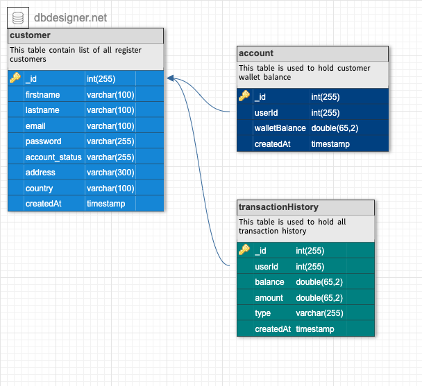

# lendsqr-be-test.
Demo Credit is a mobile lending app that requires wallet functionality. This is needed as borrowers need a wallet to receive the loans they have been granted and also send the money for repayments.

### Local Installation guide
> First, you need to clone this repo to your device by running the following on terminal
>> git clone https://github.com/tunjiNg01/lendsqr-be-test..git

> After the repo is cloned, open your favorite **text editor** and navigate to the project file and run npm install in the terminal, this will install all dependency

> Lastly, import the DB schema into your local database and ensure your connection parameters are correct, the DB schema will be found in the asset folder in the src directory

### Dependencies and their uses
> **express**: Used for server setup

> **typescript**: To ensure type safety and prevent avoidable bugs

> **bcrypt**: This is used for password encryption

> **concurrently**: Used to run multiple commands concurrently.

> **cookie-parser**: Used as middleware that parses cookie header and populates the request object with req.cookies

> **cors**: Used as a middleware that can be used to enable CORS with various options.

> **jsonwebtoken**: Used for token encription 

> **dotenv**: Used to provide an environment variable

> **express-rate-limit**: Used as a middleware to limit the number of requests from a certain IP address to prevent **DDOS attacks** or prevent malicious **bot activities**

> **knex**: User as ORM for database activities

> **rimraf**: Used to remove existing typescript generated dist folder before creating a new one

### ER - Diagram

### Folder Structure
* **src** 📁: The source directory contains all the project files.
  * **models** 📁: This folder contains the DB connection instance and some type of interface
  * **controller** 📁: This folder contains all the **API** controller files
  * **routes** 📁: This folder contains all the route files
  * **helper** 📁: This folder contain some reusable utility function
  * **app.ts** 🗃️: This is where the app is scaffolded
  * server.ts 🗃️: This is the entry point of the application
* **asset** 📁: This folder contains the DB schema and the ER- diagram
* **package.json** 🗃️: This file contains the application info, script, and dependencies.

